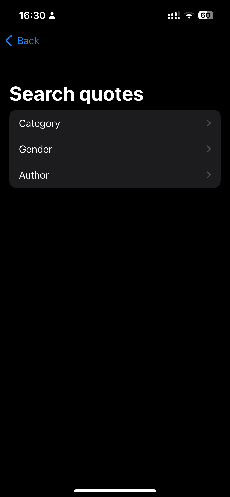

# MotivationCards
## _App that displays motivational and inspriring messages and quotes_

SwiftUI app that gets random quote from database by sending POST HTTP request to web service written in .NET. App also allows you to serach for speciffic quote.

.NET web servise that handles HTTP requests and gets quotes from database. It also saves new quotes to database

Flutter app that can get quotes but is also used to create quoetes by sending HTTP request to .NET core web service

## Features

- create quote
- get random quote
- search quotes by category, author name, author gender

### Homepage iOS (get random quote)

### Create quote (Flutter)

### Search quote iOS

### List of categories iOS

### List of quotes iOS

